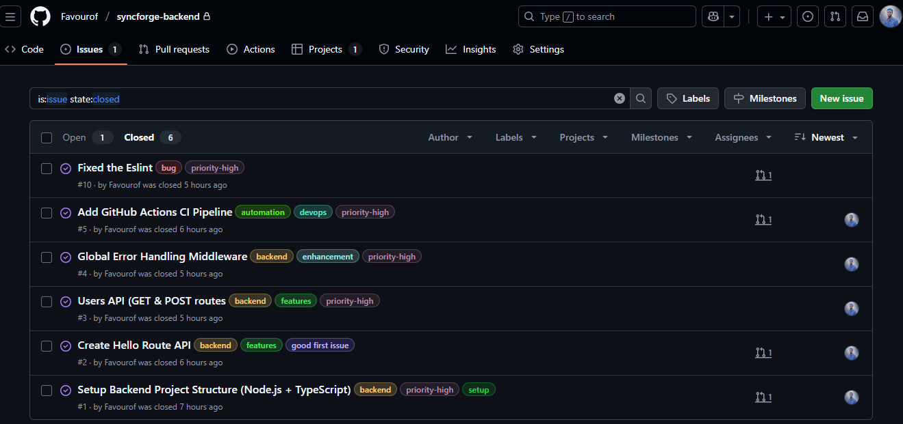
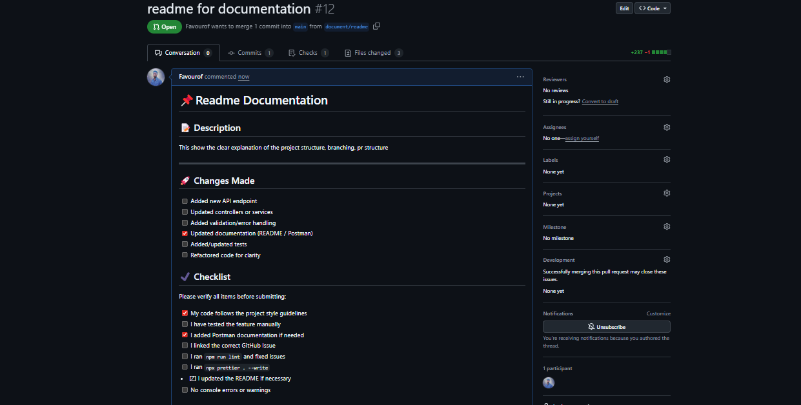
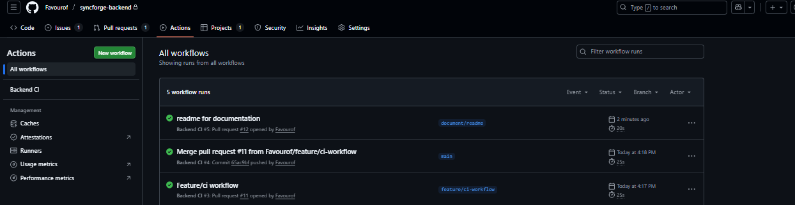
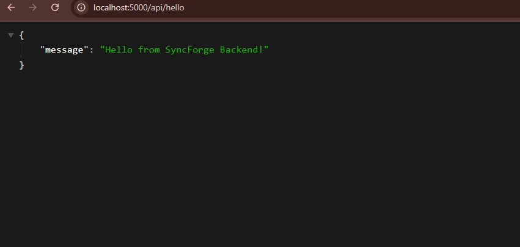

# SyncForge Backend API (Week 10 Challenge)

  


---

## 📖 Overview
**SyncForge Backend** is a **Node.js + Express + TypeScript API** built for **Week 10 of the Software Engineering Program**.  
This project demonstrates:

- REST API development  
- TypeScript best practices  
- Error handling  
- Automated linting + formatting  
- CI/CD pipeline with GitHub Actions  
- Branching strategy  
- Pull Requests & code reviews  
- API documentation via Postman  

---

## 🚀 Features
- `GET /api/hello`  
- `GET /api/users`  
- `POST /api/users`  
- Central error handler  
- TypeScript interfaces  
- Prettier + ESLint setup  
- Automated CI pipeline  
- Husky pre-commit hooks  

---

## 📁 Project Structure
```
syncforge-backend/ 
│ 
├── src/ 
│ ├── controllers/ 
│ │ 
├── hello.controller.ts 
│ │ └── user.controller.ts 
│ ├── middlewares/ 
│ │ └── errorHandler.ts 
│ ├── routes/ 
│ │ ├── hello.route.ts 
│ │ └── user.route.ts 
│ ├── utils/ 
│ │ └── ApiError.ts 
│ ├── app.ts │ 
└── server.ts 
│ ├── .github/workflows/ci.yml 
├── eslint.config.js 
├── tsconfig.json 
├── package.json 
└── README.md

```


---

## ⚙️ Tech Stack
- Node.js (18+)  
- Express.js  
- TypeScript  
- ESLint + Prettier  
- Husky + lint-staged  
- GitHub Actions  

---

## 🛠️ Installation & Setup
1️⃣ Clone the project:
```bash
git clone https://github.com/Favourof/syncforge-backend.git
cd syncforge-backend
```
## 2️⃣ Install dependencies:

```bash
npm install
```
## 3️⃣ Start development server:


```bash
npm run dev
Server runs at: 👉 http://localhost:5000
```

## PI Documentation
### 💬 Hello Route
GET /api/hello Response:

```json
{
  "success": true,
  "message": "Hello from SyncForge API"
}
👤 Users Route
GET /api/users Returns all users. Response:

json
{
  "success": true,
  "data": []
}
POST /api/users Body:

json
{
  "name": "favour",
  "email": "favour@gmail.com"
}
Response:

json
{
  "success": true,
  "data": {
    "id": 123456,
    "name": "favour",
    "email": "favour@gmail.com"
  }
}

```
## 🧪 Postman Collection

A Postman collection is included inside the repository: SyncForge Backend.postman_collection.json

You can import it directly into Postman. Included Routes:

GET /api/hello

GET /api/users

POST /api/users

## 🧰 Development Tools

Run lint:

```bash
npm run lint
Run Prettier:
```

```bash
npm run format
```

## 🛡️ Error Handling
All thrown errors pass through ApiError then handled in: src/middlewares/errorHandler.ts

This ensures consistent output for invalid input.

## 🔄 CI/CD Pipeline (GitHub Actions)
File: .github/workflows/ci.yml

CI steps include:

Install dependencies

Run ESLint

Run TypeScript build check

Ensure project follows standards

## 🌿 Branching Strategy
This project follows the Feature Branch Workflow:

Branch	Purpose
main	Stable, production-ready
feature/*	New features
fix/*	Bug fixes
docs/*	Documentation updates
Example flow:

```
git checkout -b feature/add-user-api
git push origin feature/add-user-api
```
## 🔍 Pull Request Workflow
Every PR must:

Link a related Issue

Contain screenshots of API responses

Use the PR template

Pass CI checks

Include proper description

Follow the checklist

## 🧑‍💻 Mock Code Reviews
During Week 10:

At least 2 PRs received mock reviews

Reviewer comments were added

Changes applied and commits pushed

This demonstrates collaboration workflows.

📸 Screenshots
1. Issues Created  


2. Pull Requests  


3. CI Pipeline Passing  


4. API Responses  


🤝 Contributing Guidelines
Always create a branch before working

Follow naming convention (feature/*, fix/*)

Open a Pull Request

Request review

Ensure CI passes

Merge after approval